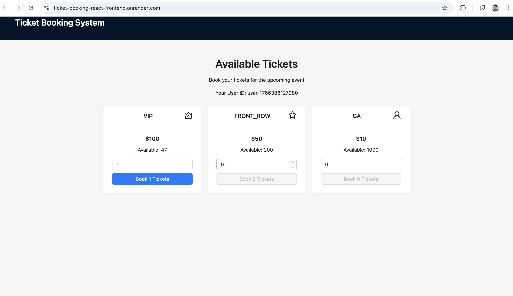

# Ticket Booking React Frontend

A modern, scalable React application for booking event tickets, built with TypeScript and Vite. This frontend provides a user-friendly interface to view available tickets and book them for different tiers (VIP, FRONT_ROW, GA).

## 🚀 Live Demo

**Try it out**: [https://ticket-booking-react-frontend.onrender.com/](https://ticket-booking-react-frontend.onrender.com/)

The application is currently deployed as a static site on Render cloud service.

⚠️ **Free Tier Limitations**: This demo uses Render's free tier, which may have limitations:

- Service sleeps after inactivity and takes ~30-60 seconds to wake up for the first request
- Limited concurrent requests and bandwidth
- Not suitable for high-traffic scenarios

## 📱 UI Preview



_Screenshot of the ticket booking interface showing available tickets with booking controls_

## Features

- **Ticket Display**: View available tickets with pricing and quantities.
- **Booking System**: Select quantities and book tickets for specific tiers.
- **Real-time Updates**: Automatic cache invalidation after bookings.
- **Error Handling**: Comprehensive error handling with retry options.
- **Responsive Design**: Built with Ant Design for a polished UI.
- **Testing**: Full unit test coverage with Jest and React Testing Library.
- **Performance Optimizations**: React.memo for components, useCallback for handlers, React Query caching, and Vite bundle splitting.

## Tech Stack

- **Frontend Framework**: React 18 with TypeScript
- **Build Tool**: Vite
- **UI Library**: Ant Design (Antd)
- **State Management**: TanStack React Query for server state
- **HTTP Client**: Axios
- **Routing**: React Router DOM
- **Testing**: Jest, React Testing Library, ts-jest
- **Linting**: ESLint with TypeScript support
- **Code Quality**: Prettier (implied), modular architecture

## Project Structure

```
src/
├── api/                 # API client and service functions
│   ├── client.ts        # Axios client configuration
│   └── tickets.ts       # Ticket-related API calls
├── components/          # Reusable UI components
│   ├── ErrorDisplay.tsx # Error message component
│   ├── LoadingDisplay.tsx # Loading spinner component
│   ├── TicketCard.tsx   # Individual ticket card
│   └── TicketList.tsx   # List of ticket cards
├── constants/           # Application constants (endpoints, messages)
├── hooks/               # Custom React hooks
│   ├── useBookTickets.ts # Booking mutation hook
│   ├── useTicketBooking.ts # Booking state management
│   └── useTickets.ts    # Tickets fetching hook
├── pages/               # Page components
│   └── HomePage.tsx     # Main ticket booking page
├── types/               # TypeScript type definitions
│   ├── api.ts           # API-related types
│   ├── api-error.ts     # Error types
│   └── components.ts    # Component prop types
├── utils/               # Utility functions
│   ├── parseApiError.ts # API error parsing
│   └── ticketIcons.tsx  # Ticket tier icons
└── assets/              # Static assets
```

## Getting Started

### Prerequisites

- Node.js (v18 or higher)
- npm or yarn
- Backend API server: [ticket-booking-node-backend](https://github.com/pradeepshrestha14/ticket-booking-node-backend) running on `http://localhost:4000` (or set `VITE_API_URL`)

### Installation

1. Clone the repository:

   ```bash
   git clone https://github.com/pradeepshrestha14/ticket-booking-react-frontend.git
   cd ticket-booking-react-frontend
   ```

2. Install dependencies:

   ```bash
   npm install
   ```

3. Start the development server:

   ```bash
   npm run dev
   ```

4. Open [http://localhost:5173](http://localhost:5173) in your browser.

   **Development Tools**: React Query DevTools are enabled in development mode. Look for the React Query icon in the bottom-right corner to inspect queries, mutations, and cache state.

### Build for Production

```bash
npm run build
npm run preview
```

### Testing

Run the test suite:

```bash
npm test
```

The project includes comprehensive unit tests covering:

- **Components**: `TicketCard`, `LoadingDisplay`, `ErrorDisplay`, `TicketList`
- **Custom Hooks**: `useTickets`, `useBookTickets`, `useTicketBooking`
- **API Functions**: `getAllTickets`, `bookTickets`
- **Utilities**: `parseApiError`

**Test Coverage**: 7 test suites with 19 total tests, achieving full coverage of core functionality.

**Testing Stack**:

- **Jest**: Test runner with TypeScript support via ts-jest
- **React Testing Library**: Component testing utilities
- **Axios Mock Adapter**: API mocking for isolated testing
- **Jest DOM**: Additional DOM matchers

### Linting

Check code quality:

```bash
npm run lint
```

## API Integration

The application communicates with a backend API for ticket data. Ensure the backend is running and accessible.

**Concurrency Considerations**: The frontend uses optimistic updates for better UX, but race conditions and double booking prevention are handled server-side. For detailed discussion of concurrency handling and race condition mitigation, see the [backend repository README](https://github.com/pradeepshrestha14/ticket-booking-node-backend).

### API Endpoints

- **GET /api/tickets**: Fetch all available tickets

  - Response: `ApiResponse<Ticket[]>`
  - Ticket object: `{ id: number, tier: TicketTier, price: number, totalQuantity: number, availableQuantity: number }`

- **POST /api/tickets/book**: Book tickets
  - Request Body: `{ userId: string, tier: TicketTier, quantity: number }`
  - Response: `ApiResponse<BookTicketsResponse>`
  - BookTicketsResponse: `{ tier: TicketTier, bookedQuantity: number, remainingQuantity: number, totalAmount: number }`

For more details on the backend implementation and system architecture, see the [backend repository](https://github.com/pradeepshrestha14/ticket-booking-node-backend) and its [architectural decisions](https://github.com/pradeepshrestha14/ticket-booking-node-backend/blob/main/ARCHITECTURAL_DECISIONS.md).

### Environment Variables

- `VITE_API_URL`: Backend API base URL (default: `http://localhost:4000`)

## Usage

1. The app displays available tickets in cards.
2. Select quantity for desired tier.
3. Click "Book" to confirm booking.
4. Success/error messages appear accordingly.
5. Tickets cache updates automatically after booking.

**Note**: In high-traffic scenarios, concurrent bookings may result in race conditions. The backend handles double booking prevention, but UI updates are optimistic for better user experience. For detailed concurrency handling, see the [backend repository](https://github.com/pradeepshrestha14/ticket-booking-node-backend).

**Payment Simulation**: The backend simulates payment processing. You may encounter "payment failure" errors during booking attempts - this is expected behavior for testing error handling scenarios.

## Contributing

1. Fork the repository
2. Create a feature branch
3. Make changes and add tests
4. Ensure all tests pass: `npm test`
5. Submit a pull request
